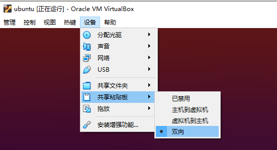
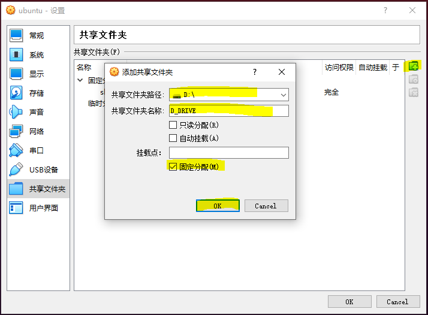
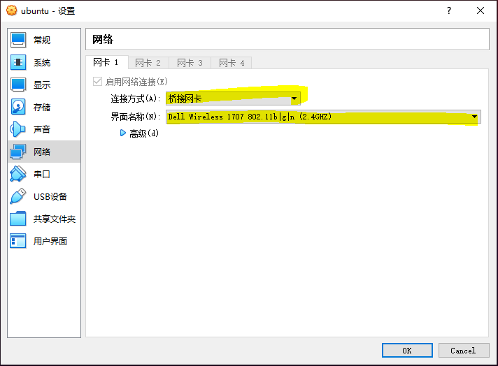

# 使用虚拟机打造Windows+Linux融合工作环境

本文描述如何在Windows上通过虚拟机安装Linux系统以及服务，实现一个Windows和Linux融合的工作环境。实现Windows和Linux上资源的共享，包括，网络共享，键鼠共享，剪切板共享，文件共享。在Windows上，可以通过SSH终端命令行操作Linux，通过SMB服务访问Linux中的目录和文件；在Linux，通过vbofs访问Windows上的目录和文件。本文使用的虚拟机为VirtualBox，Linux系统为Ubuntu Desktop版本，Windows系统为Win10系统。

## 下载软件

1. **VirtualBox下载**

[官网地址](https://www.virtualbox.org/)   [百度网盘下载地址](https://pan.baidu.com/s/1nOSv5RXUKLBiWT4sgavcJQ) 提取码：kizu

2. **Ubuntu下载** 

[官网桌面版下载地址](https://ubuntu.com/download/desktop)   [百度网盘下载地址 （*本文使用Ubuntu 20.04.3 LTS*)](https://pan.baidu.com/s/1f0IS2sg-PQDlA4uy-voi2w) 提取码：9981

## 安装VirtualBox

VirtualBox安装很简单，默认安装到底。可以参考[VirtualBox的安装详解](https://jingyan.baidu.com/article/0f5fb099362c176d8234ea64.html)

## 安装Ubuntu

加载Ubuntu的iso文件启动虚拟器，根据提示一步一步安装。

## 安装增强功能

安装完Ubuntu后，在VirtualBox菜单中选择`设备`-`安装增强功能` Ubuntu中会出现安装界面，根据提示完成增强功能安装。

### 共享剪切板



### Linux访问Windows文件夹

1. 设备-共享文件夹-共享文件夹, 点击右面的+号设置需要共享的路径，共享文件名称随便设置一个，记住，后面需要使用，这里假定是D_DRIVE，如果Linux中只能读取不能写勾选只读分配，不要勾选自动挂载，勾选固定分配。点击OK。



2. 手工挂载共享文件夹

   ``` sh 
   cd /mnt
   sudo mkdir win-share
   sudo mount -t vboxsf D_DRIVE /mnt/win-share
   ```

3. 启动时挂载文件夹

   手工挂载的文件夹每次启动需要重新挂载，通过修改/etc/fstab可以在Linux启动时自动挂载，

   ``` sh
   cd /etc
   sudo vi fstab
   ```
   
   在fstab末尾添加下面一句(D_DRIVE为上面设置的名称)，这样每次启动记得挂接windows上的文件夹
   
   ``` sh
   # 在fstab末尾添加
   D_DRIVE /mnt/win-share vboxsf defaults 0 0
   ```
   

## 配置网络

建议选择桥接模式，界面名称中选择Windows中的网卡，我这里设置的是一个无线网卡。桥接模式下虚拟机就相当于链接在路由器上，局域网中的所有电脑都可以访问。使用其他网络配置课参考 [VirtualBox虚拟机的四种主要网络设置方式](VirtualBox虚拟机的四种主要网络设置方式.html) 。



## 安装ssh服务

``` sh
# 安装服务
sudo apt install openssh-server
# 启动服务
sudo service ssh start
# 查看服务是否运行
ps -aux | grep ssh
```

## smb服务

安装smb服务

``` sh
sudo apt-get install samba samba-common
```

### smb服务配置

备份并打开smb.conf

``` sh
cd /etc/samba/
sudo cp smb.conf smb.conf.bak
sudo vi smb.conf
```

修改配置文件,path为需要共享的目录. 

``` sh
[share]
    comment = samba home directory 
    path = /home/your_path
    browseable = yes
    public = yes
    writeable = yes
    read only = no
    valid users = username
    create mask = 0644
    directory mask = 0775
    force user = username
    force group = username
    available = yes
    guest ok = yes
    security = share

```

修改完需要重启服务

### 添加smb服务用户

``` sh
sudo adduser user
```

### 重启smb服务

``` sh
sudo service smbd restart
```

