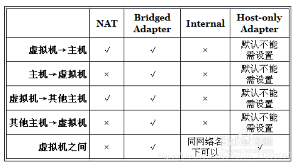
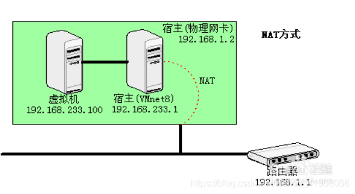
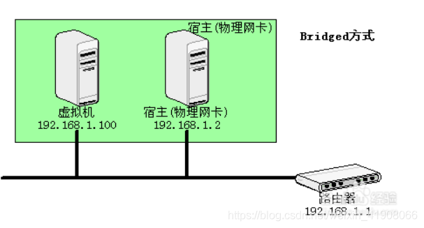
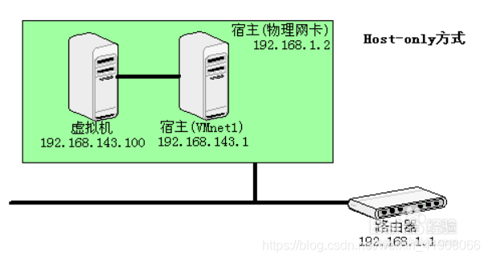

# VirtualBox虚拟机的四种主要网络设置方式

Oracle VirtualBox的网络配置及应用主要有四种网络接入模式，分别是：
1、NAT 网络地址转换模式(NAT,Network Address Translation)
2、Bridged Adapter 桥接模式
3、Internal 内部网络模式
4、Host-only Adapter 主机模式

### 第一种 NAT模式：

NAT模式是最简单的实现虚拟机上网的方式，可以这样理解：Vhost访问网络的所有数据都是由主机提供的，vhost并不真实存在于网络中，主机与网络中的任何机器都不能查看和访问到Vhost的存在。
虚拟机与主机关系：
只能单向访问，虚拟机可以通过网络访问到主机，主机无法通过网络访问到虚拟机。
虚拟机与网络中其他主机的关系：
只能单向访问，虚拟机可以访问到网络中其他主机，其他主机不能通过网络访问到虚拟机。
虚拟机与虚拟机之间的关系：
相互不能访问，虚拟机与虚拟机各自完全独立，相互间无法通过网络访问彼此。
IP:10.0.2.15
网关：10.0.2.2
DNS：10.0.2.3
一台虚拟机的多个网卡可以被设定使用 NAT， 第一个网卡连接了到专用网 10.0.2.0，第二个网卡连接到专用网络 10.0.3.0，等等。默认得到的客户端ip（IP Address）是10.0.2.15，网关（Gateway）是10.0.2.2，域名服务器（DNS）是10.0.2.3，可以手动参考这个进行修改。
NAT方案优缺点：
笔记本已插网线时： 虚拟机可以访问主机，虚拟机可以访问互联网，在做了端口映射后（最后有说明），主机可以访问虚拟机上的服务（如数据库）。
笔记本没插网线时： 主机的“本地连接”有红叉的，虚拟机可以访问主机，虚拟机不可以访问互联网，在做了端口映射后，主机可以访问虚拟机上的服务（如数据库）。

### 第二种 Bridged Adapter模式：

网桥模式是我最喜欢的用的一种模式，同时，模拟度也是相当完美。你可以这样理解，它是通过主机网卡，架设了一条桥，直接连入到网络中了。因此，它使得虚拟机能被分配到一个网络中独立的IP，所有网络功能完全和在网络中的真实机器一样。
虚拟机与主机关系：
可以相互访问，因为虚拟机在真实网络段中有独立IP，主机与虚拟机处于同一网络段中，彼此可以通过各自IP相互访问。
虚拟机于网络中其他主机关系：
可以相互访问，同样因为虚拟机在真实网络段中有独立IP，虚拟机与所有网络其他主机处于同一网络段中，彼此可以通过各自IP相互访问。
虚拟机于虚拟机关系：
可以相互访问，原因同上。
IP：一般是DHCP分配的，与主机的“本地连接”的IP 是同一网段的。虚拟机就能与主机互相通信。
笔记本已插网线时：（若网络中有DHCP服务器）主机与虚拟机会通过DHCP分别得到一个IP，这两个IP在同一网段。 主机与虚拟机可以ping通，虚拟机可以上互联网。
笔记本没插网线时：主机与虚拟机不能通信。主机的“本地连接”有红叉，就不能手工指定IP。虚拟机也不能通过DHCP得到IP地址，手工指定IP后，也无法与主机通信，因为主机无IP。
这时主机的VirtualBox Host-Only Network 网卡是有ip的，192.168.56.1。虚拟机就算手工指定了IP 192.168.56.，也ping不能主机。

### 第三种 Internal模式：
内网模式，顾名思义就是内部网络模式，虚拟机与外网完全断开，只实现虚拟机于虚拟机之间的内部网络模式。
虚拟机与主机关系：
不能相互访问，彼此不属于同一个网络，无法相互访问。
虚拟机与网络中其他主机关系：
不能相互访问，理由同上。
虚拟机与虚拟机关系：
可以相互访问，前提是在设置网络时，两台虚拟机设置同一网络名称。如上配置图中，名称为intnet。
IP: VirtualBox的DHCP服务器会为它分配IP ，一般得到的是192.168.56.101，因为是从101起分的，也可手工指定192.168.56.。
笔记本已插网线时：虚拟机可以与主机的VirtualBox Host-Only Network 网卡通信
这种方案不受主机本地连接（网卡）是否有红叉的影响。
第四种 Host-only Adapter模式：

###  第四种 主机模式

这是一种比较复杂的模式，需要有比较扎实的网络基础知识才能玩转。可以说前面几种模式所实现的功能，在这种模式下，通过虚拟机及网卡的设置都可以被实现。
我们可以理解为Vbox在主机中模拟出一张专供虚拟机使用的网卡，所有虚拟机都是连接到该网卡上的，我们可以通过设置这张网卡来实现上网及其他很多功能，比如（网卡共享、网卡桥接等）。
虚拟机与主机关系
默认不能相互访问，双方不属于同一IP段，host-only网卡默认IP段为192.168.56.X 子网掩码为255.255.255.0，后面的虚拟机被分配到的也都是这个网段。通过网卡共享、网卡桥接等，可以实现虚拟机于主机相互访问。
虚拟机与网络主机关系
默认不能相互访问，原因同上，通过设置，可以实现相互访问。
虚拟机与虚拟机关系
默认可以相互访问，都是同处于一个网段。
虚拟机访问主机 用的是主机的VirtualBox Host-Only Network网卡的IP：192.168.56.1 ，不管主机“本地连接”有无红叉，永远通。
主机访问虚拟机，用是的虚拟机的网卡3的IP： 192.168.56.101 ，不管主机“本地连接”有无红叉，永远通。
虚拟机访问互联网，用的是自己的网卡2， 这时主机要能通过“本地连接”有线上网，（无线网卡不行）
通过对以上几种网络模式的了解，我们就可以灵活运用，模拟组建出我们所想要的任何一种网络环境了。

原文链接：https://blog.csdn.net/weixin_41908066/article/details/109501446