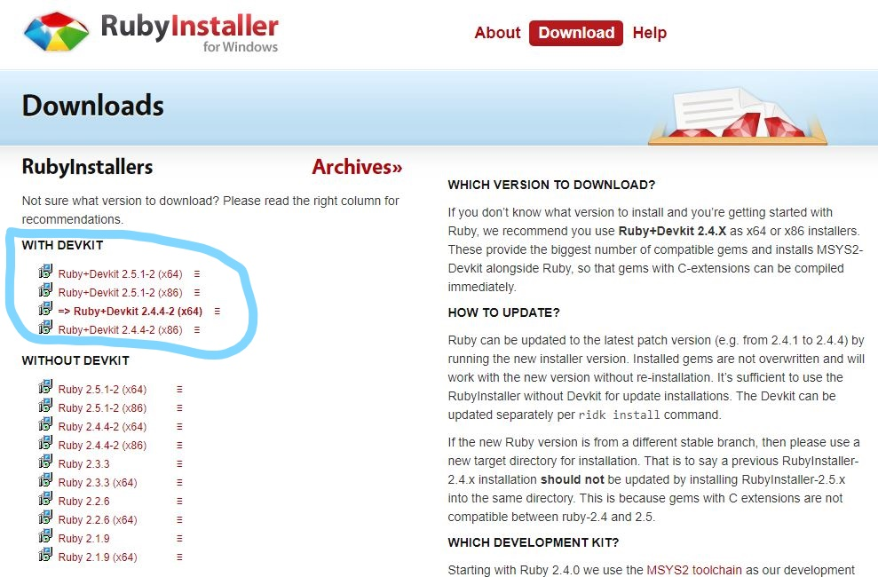
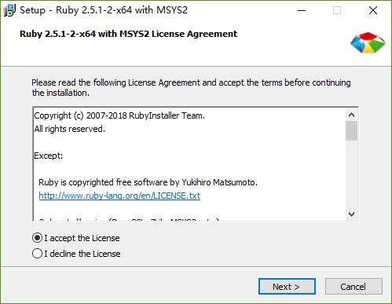
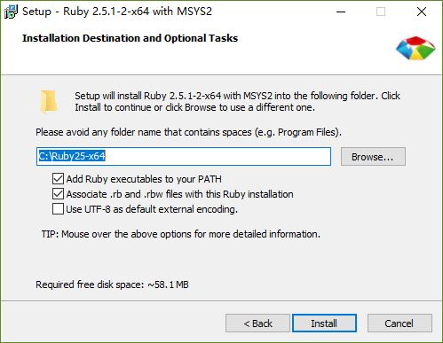
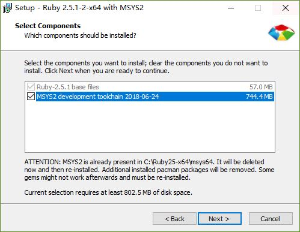
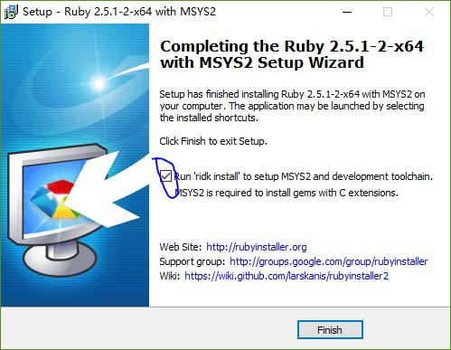
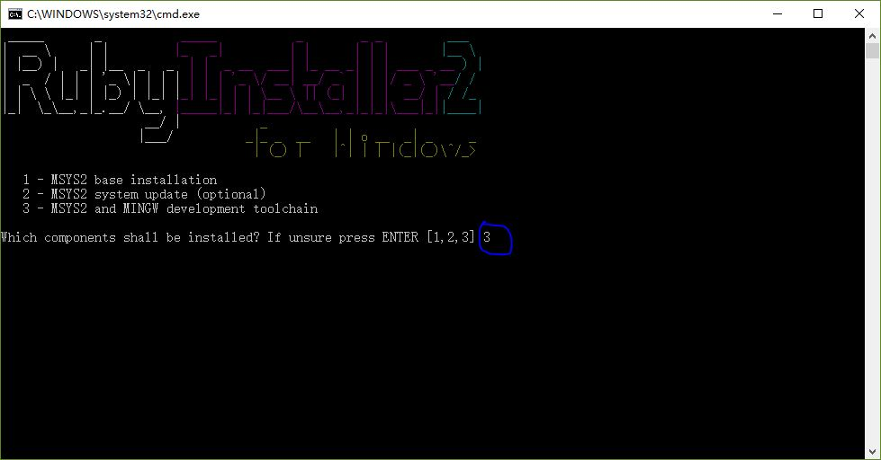
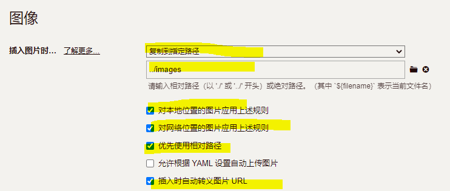

# Windows上安装jekyll

Jun 29, 2018

## 在Windows上安装Ruby环境

在地址https://rubyinstaller.org/downloads/下载ruby安装包，选择带有**Devkit**的安装包,因为jekyll中部分代码需要使用编译系统进行编译。

 

## 安装ruby

Next到底,选择默认的路径,勾选**Add Ruby executables to your PATH**把ruby加入到系统环境中，勾选**MSYS2 development toolchain**安装开发工具链。











## 安装jekyll

安装完ruby之后，启动ruby命令行，执行下面的命令安装jekyll。

```sh
gem install jekyll
```

> 由于国内网络的原因，安装失败需要更换国内的源
>
> 
>
> 
>
> 执行上面的语句之前，记得把原来的源删掉，当然，你也可以在上面的语句后面加上
>
> --remove 你目前的源地址

查看jekyll版本

```sh
jekyll -v
```

现在，jekyll已经安装成功了，你可以使用jekyll创建自己的blog了。

创建自己的博客

``` sh
jekyll new blog
```

运行服务器在本地测试

``` sh
jekyll serve -w --host 0.0.0.0 --port 80
Warning: the running version of Bundler (2.1.4) is older than the version that created the lockfile (2.2.33). We suggest you to upgrade to the version that created the lockfile by running `gem install bundler:2.2.33`.
Configuration file: D:/xx/blog/_config.yml
            Source: D:/xx/blog
       Destination: D:/xx/blog/_site
 Incremental build: disabled. Enable with --incremental
      Generating...
       Jekyll Feed: Generating feed for posts
                    done in 2.346 seconds.
 Auto-regeneration: enabled for 'D:/xx/blog'
    Server address: http://0.0.0.0:80/
  Server running... press ctrl-c to stop.
```

在浏览器上输入 127.0.0.1可以访问博客内容。

# jekyll如何使用中文路径

### 出现问题

最近在使用jekyll在本地预览自己写的博客无法正常打开，而提交到github上却可以正常解析。看了一下发现是文件写的博客有什么变化，原来是因为博客的markdown文件使用了中文文件名，jekyll无法正常解析出现乱码。

### 解决方法：

修改安装目录\Ruby22-x64\lib\ruby\2.2.0\webrick\httpservlet下的filehandler.rb文件，建议先备份。找到下列两处，添加一句（+的一行为添加部分）

```javascript
path = req.path_info.dup.force_encoding(Encoding.find("filesystem"))
+ path.force_encoding("UTF-8") # 加入编码
if trailing_pathsep?(req.path_info)     
break if base == "/"
+ base.force_encoding("UTF-8") #加入編碼
break unless File.directory?(File.expand_path(res.filename + base))    
```

修改完重新jekyll serve即可支持中文文件名。


## 与Typora一起使用

Typora是一个所见即所得得markdown编辑软件，可以用Typora编译博客的markwown，按照下面的设置，可以实现Typora和Jekyll上图片都显示正常。

- _config.yml中增加下面的设置。

``` yml
defaults:
  -
    scope:
      path: ""
      type: "posts"
    values:
      layout: "post"
      permalink: /:year-:month-:day/:title.html
```

- Typora中的设置



