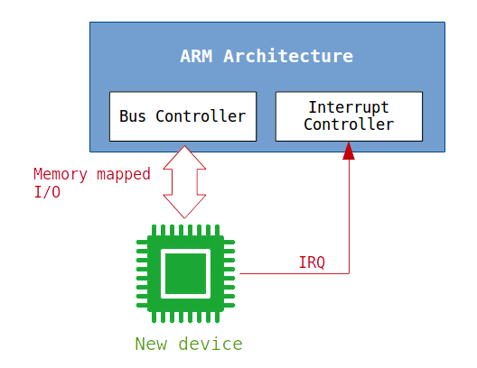

# 如何在QEMU中添加虚拟设备

QEMU是一个很好的开发工具。如果您是Linux内核开发人员，而您的目标设备还没有发布，那么您可能会担心日程安排。使用QEMU，您现在就可以通过模拟装置，创建驱动程序!

## 设备设计

这里有一个例子。SoC采用ARM架构。新设备将附加到特定的内存总线上，并生成一个中断来通知硬件事件。



## 需求说明

为了创建系统，应该创建宿主系统和guest系统

- Host machine - QEMU
  - Emulating new device based on supported ARM machine/board
- Guest OS - Buildroot
  - Creating the driver in mainline Linux kernel
  - Rootfs

使用[Buildroot](https://buildroot.org/) 很容易创建内核映像和最小的根文件系统 - initramfs

## 使用 QEMU模拟ARM64开发板

下载QEMU。

```sh
$ git clone git://git.qemu.org/qemu.git
$ cd qemu
```

配置编译目标为aarch64-softmmu，然后编译。

```sh
$ ./configure --target-list=aarch64-softmmu
$ make
```

编译生成文件： 'aarch64-softmmu/qemu-system-aarch64'.

## 编译操作系统镜像和文件系统

开发编译

```sh
$ git clone git://git.buildroot.net/buildroot
$ cd buildroot
```

配置系统为virtual AARCH64并编译.

```sh
$ make qemu_aarch64_virt_defconfig
$ make
```

编译输出文件是 'output/images/Image' 包含根文件系统 (initramfs as CPIO)

## 运行模拟器

创建下面一个脚本

```sh
$ vi run_aarch64.sh

#!/bin/bash
QEMU="<your qemu directory>/aarch64-softmmu/qemu-system-aarch64"
KERNEL="<your buildroot directory>/output/images/Image"
$QEMU -machine virt -cpu cortex-a57 -nographic -smp 1 -m 2048 -kernel $KERNEL --append "console=ttyAMA0" -netdev user,id=unet -device virtio-net-device,netdev=unet

$ chmod a+x run_aarch64.sh
```

运行

```sh
$ ./run_aarch64.sh
Booting Linux on physical CPU 0x0
Linux version 4.8.1 (milo@milo-dev) (gcc version 5.4.0 (Buildroot 2017.02-git-01042-gd952d5292) ) #2 SMP Tue Jan 31 20:25:10 KST 2017
Boot CPU: AArch64 Processor [411fd070]
efi: Getting EFI parameters from FDT:
efi: UEFI not found.
psci: probing for conduit method from DT.
psci: PSCIv0.2 detected in firmware.
psci: Using standard PSCI v0.2 function IDs
psci: Trusted OS migration not required
percpu: Embedded 21 pages/cpu @ffffffc07ffcb000 s45208 r8192 d32616 u86016
Detected PIPT I-cache on CPU0
CPU features: enabling workaround for ARM erratum 832075
Built 1 zonelists in Zone order, mobility grouping on.  Total pages: 516096
Kernel command line: console=ttyAMA0
PID hash table entries: 4096 (order: 3, 32768 bytes)
Dentry cache hash table entries: 262144 (order: 9, 2097152 bytes)
Inode-cache hash table entries: 131072 (order: 8, 1048576 bytes)
Memory: 2053268K/2097152K available (4028K kernel code, 239K rwdata, 1040K rodata, 2048K init, 305K bss, 43884K reserved, 0K cma-reserved)
Virtual kernel memory layout:
    modules : 0xffffff8000000000 - 0xffffff8008000000   (   128 MB)
    vmalloc : 0xffffff8008000000 - 0xffffffbebfff0000   (   250 GB)
      .text : 0xffffff8008080000 - 0xffffff8008470000   (  4032 KB)
    .rodata : 0xffffff8008470000 - 0xffffff8008580000   (  1088 KB)
      .init : 0xffffff8008580000 - 0xffffff8008780000   (  2048 KB)
      .data : 0xffffff8008780000 - 0xffffff80087bbe00   (   240 KB)
       .bss : 0xffffff80087bbe00 - 0xffffff8008808484   (   306 KB)
    fixed   : 0xffffffbefe7fd000 - 0xffffffbefec00000   (  4108 KB)
    PCI I/O : 0xffffffbefee00000 - 0xffffffbeffe00000   (    16 MB)
    vmemmap : 0xffffffbf00000000 - 0xffffffc000000000   (     4 GB maximum)
              0xffffffbf00000000 - 0xffffffbf02000000   (    32 MB actual)
    memory  : 0xffffffc000000000 - 0xffffffc080000000   (  2048 MB)
SLUB: HWalign=64, Order=0-3, MinObjects=0, CPUs=1, Nodes=1
Hierarchical RCU implementation.
    Build-time adjustment of leaf fanout to 64.
    RCU restricting CPUs from NR_CPUS=64 to nr_cpu_ids=1.
RCU: Adjusting geometry for rcu_fanout_leaf=64, nr_cpu_ids=1
NR_IRQS:64 nr_irqs:64 0
arm_arch_timer: Architected cp15 timer(s) running at 62.50MHz (virt).
clocksource: arch_sys_counter: mask: 0xffffffffffffff max_cycles: 0x1cd42e208c, max_idle_ns: 881590405314 ns
sched_clock: 56 bits at 62MHz, resolution 16ns, wraps every 4398046511096ns
Console: colour dummy device 80x25
Calibrating delay loop (skipped), value calculated using timer frequency.. 125.00 BogoMIPS (lpj=250000)
pid_max: default: 32768 minimum: 301
Mount-cache hash table entries: 4096 (order: 3, 32768 bytes)
Mountpoint-cache hash table entries: 4096 (order: 3, 32768 bytes)
ASID allocator initialised with 65536 entries
EFI services will not be available.
Brought up 1 CPUs
SMP: Total of 1 processors activated.
CPU features: detected feature: 32-bit EL0 Support
CPU: All CPU(s) started at EL1
alternatives: patching kernel code
devtmpfs: initialized
DMI not present or invalid.
clocksource: jiffies: mask: 0xffffffff max_cycles: 0xffffffff, max_idle_ns: 7645041785100000 ns
NET: Registered protocol family 16
vdso: 2 pages (1 code @ ffffff8008476000, 1 data @ ffffff8008784000)
hw-breakpoint: found 6 breakpoint and 4 watchpoint registers.
DMA: preallocated 256 KiB pool for atomic allocations
Serial: AMBA PL011 UART driver
9000000.pl011: ttyAMA0 at MMIO 0x9000000 (irq = 39, base_baud = 0) is a PL011 rev1
console [ttyAMA0] enabled
SCSI subsystem initialized
dmi: Firmware registration failed.
clocksource: Switched to clocksource arch_sys_counter
NET: Registered protocol family 2
TCP established hash table entries: 16384 (order: 5, 131072 bytes)
TCP bind hash table entries: 16384 (order: 6, 262144 bytes)
TCP: Hash tables configured (established 16384 bind 16384)
UDP hash table entries: 1024 (order: 3, 32768 bytes)
UDP-Lite hash table entries: 1024 (order: 3, 32768 bytes)
NET: Registered protocol family 1
futex hash table entries: 256 (order: 3, 32768 bytes)
workingset: timestamp_bits=62 max_order=19 bucket_order=0
Block layer SCSI generic (bsg) driver version 0.4 loaded (major 252)
io scheduler noop registered
io scheduler deadline registered
io scheduler cfq registered (default)
Unable to detect cache hierarchy from DT for CPU 0
mousedev: PS/2 mouse device common for all mice
NET: Registered protocol family 10
sit: IPv6, IPv4 and MPLS over IPv4 tunneling driver
NET: Registered protocol family 17
NET: Registered protocol family 15
registered taskstats version 1
hctosys: unable to open rtc device (rtc0)
Freeing unused kernel memory: 2048K (ffffffc000580000 - ffffffc000780000)
Starting logging: OK
Initializing random number generator... random: dd: uninitialized urandom read (512 bytes read)
done.
Starting network: udhcpc: started, v1.26.2
udhcpc: sending discover
udhcpc: sending select for 10.0.2.15
udhcpc: lease of 10.0.2.15 obtained, lease time 86400
deleting routers
adding dns 10.0.2.3
OK

Welcome to Buildroot
buildroot login: root
# uname -a
Linux buildroot 4.8.1 #2 SMP Tue Jan 31 20:25:10 KST 2017 aarch64 GNU/Linux
```

上面的信息表示aarch64 linux内核在ARM64模拟器上运行起来了，目前还没有我们自己创建的新设备。 

现在开始创建新设备

## 设备模拟

- ### 设备名称

定义VIRT_FOO 

```c
[qemu/include/hw/arm/virt.h]

@@ -72,6 +72,7 @@ enum {
     VIRT_GPIO,
     VIRT_SECURE_UART,
     VIRT_SECURE_MEM,
+    VIRT_FOO,
 };
```

- ### 配置内存映射

添加新的设备, 我们需要知道aarch-softmmu的整个内存运行。

```c
[qemu/hw/arm/virt.c]

static const MemMapEntry a15memmap[] = {
    /* Space up to 0x8000000 is reserved for a boot ROM */
    [VIRT_FLASH] =              {          0, 0x08000000 },
    [VIRT_CPUPERIPHS] =         { 0x08000000, 0x00020000 },
    /* GIC distributor and CPU interfaces sit inside the CPU peripheral space */
    [VIRT_GIC_DIST] =           { 0x08000000, 0x00010000 },
    [VIRT_GIC_CPU] =            { 0x08010000, 0x00010000 },
    [VIRT_GIC_V2M] =            { 0x08020000, 0x00001000 },
    /* The space in between here is reserved for GICv3 CPU/vCPU/HYP */
    [VIRT_GIC_ITS] =            { 0x08080000, 0x00020000 },
    /* This redistributor space allows up to 2*64kB*123 CPUs */
    [VIRT_GIC_REDIST] =         { 0x080A0000, 0x00F60000 },
    [VIRT_UART] =               { 0x09000000, 0x00001000 },
    [VIRT_RTC] =                { 0x09010000, 0x00001000 },
    [VIRT_FW_CFG] =             { 0x09020000, 0x00000018 },
    [VIRT_GPIO] =               { 0x09030000, 0x00001000 },
    [VIRT_SECURE_UART] =        { 0x09040000, 0x00001000 },
    [VIRT_MMIO] =               { 0x0a000000, 0x00000200 },
    /* ...repeating for a total of NUM_VIRTIO_TRANSPORTS, each of that size */
    [VIRT_PLATFORM_BUS] =       { 0x0c000000, 0x02000000 },
    [VIRT_SECURE_MEM] =         { 0x0e000000, 0x01000000 },
    [VIRT_PCIE_MMIO] =          { 0x10000000, 0x2eff0000 },
    [VIRT_PCIE_PIO] =           { 0x3eff0000, 0x00010000 },
    [VIRT_PCIE_ECAM] =          { 0x3f000000, 0x01000000 },
    [VIRT_MEM] =                { 0x40000000, RAMLIMIT_BYTES },
    /* Second PCIe window, 512GB wide at the 512GB boundary */
    [VIRT_PCIE_MMIO_HIGH] =   { 0x8000000000ULL, 0x8000000000ULL },
};
```

找到有效可用的位置.  MMIO and PLATFORM_BUS之间的可以看起来是可以用的。 VIRT_FOO内存映射开始于 0x0b000000并在大小为 0x200。

```c
@@ -140,6 +140,7 @@ static const MemMapEntry a15memmap[] = {
     [VIRT_GPIO] =               { 0x09030000, 0x00001000 },
     [VIRT_SECURE_UART] =        { 0x09040000, 0x00001000 },
     [VIRT_MMIO] =               { 0x0a000000, 0x00000200 },
+    [VIRT_FOO] =                { 0x0b000000, 0x00000200 },
     /* ...repeating for a total of NUM_VIRTIO_TRANSPORTS, each of that size */
     [VIRT_PLATFORM_BUS] =       { 0x0c000000, 0x02000000 },
     [VIRT_SECURE_MEM] =         { 0x0e000000, 0x01000000 },
```

- ### 创建中断

中断号需要在aarch64 GIC (通用中断管理器)中分配. 在这里指定中断号。

```c
[qemu/hw/arm/virt.c]

static const int a15irqmap[] = {
    [VIRT_UART] = 1, 
    [VIRT_RTC] = 2, 
    [VIRT_PCIE] = 3, /* ... to 6 */
    [VIRT_GPIO] = 7, 
    [VIRT_SECURE_UART] = 8, 
    [VIRT_MMIO] = 16, /* ...to 16 + NUM_VIRTIO_TRANSPORTS - 1 */
    [VIRT_GIC_V2M] = 48, /* ...to 48 + NUM_GICV2M_SPIS - 1 */
    [VIRT_PLATFORM_BUS] = 112, /* ...to 112 + PLATFORM_BUS_NUM_IRQS -1 */
};
```

在 VIRT_PLATFORM_BUS后添加中断号176. (PLATFORM_BUS_NUM_IRQS = 64)

```c
@@ -160,6 +161,7 @@ static const int a15irqmap[] = {
     [VIRT_MMIO] = 16, /* ...to 16 + NUM_VIRTIO_TRANSPORTS - 1 */
     [VIRT_GIC_V2M] = 48, /* ...to 48 + NUM_GICV2M_SPIS - 1 */
     [VIRT_PLATFORM_BUS] = 112, /* ...to 112 + PLATFORM_BUS_NUM_IRQS -1 */
+    [VIRT_FOO] = 176,
 };
```

- ### 寄存器布局

假定FOO设备的寄存器内存映射入下面所示：

**ID register**

| Address                  | R/W  | Description                |
| :----------------------- | :--- | :------------------------- |
| 0x0b00 0000 (offset = 0) | RO   | Chip ID. Default is 0xf001 |

**INIT register**

| Address                  | R/W  | Description       |
| :----------------------- | :--- | :---------------- |
| 0x0b00 0004 (offset = 4) | R/W  | bit0: chip enable |

**COMMAND register**

| Address                  | R/W  | Description         |
| :----------------------- | :--- | :------------------ |
| 0x0b00 0008 (offset = 8) | R/W  | Command buffer data |

**INTERRUPT STATUS register**

| Address                    | R/W  | Description                                |
| :------------------------- | :--- | :----------------------------------------- |
| 0x0b00 000c (offset = 0xc) | RO   | bit0: device is enabled                    |
|                            |      | bit1: command buffer is dequeued correctly |

在这个例子里, FOO 设备有四个寄存器. 寄存器可以通过内存总线访问. 范围是从 0x0b000000 到0x0b00000c. 大小0x200足够大了。

Device is enabled from INIT register. If the device is enabled successfully, then interrupt pin goes to HIGH. Whenver COMMAND register is updated, interrupt pin also goes to HIGH. After INTERRUPT STATUS register is read, then interrupt pin will goes to default state - LOW.

Well, how do we create the new device in QEMU? There are many examples under qemu/hw/. FOO device is created under qemu/hw/misc/.

```c
[qemu/hw/misc/virt_foo.c]

/*
 * Virtual Foo Device
 *
 * Copyright (c) 2017 Milo Kim <woogyom.kim@gmail.com>
 *
 * This program is free software; you can redistribute it and/or
 * modify it under the terms of the GNU General Public License
 * as published by the Free Software Foundation; either version 2
 * of the License, or (at your option) any later version.
 *
 * This program is distributed in the hope that it will be useful,
 * but WITHOUT ANY WARRANTY; without even the implied warranty of
 * MERCHANTABILITY or FITNESS FOR A PARTICULAR PURPOSE.  See the
 * GNU General Public License for more details.
 *
 * You should have received a copy of the GNU General Public License
 * along with this program; if not, see <http://www.gnu.org/licenses/>.
 *
 */

#include "qemu/osdep.h"
#include "hw/hw.h"
#include "hw/sysbus.h"
#include "qemu/bitops.h"
#include "qemu/log.h"

#define TYPE_VIRT_FOO          "virt-foo"
#define VIRT_FOO(obj)          OBJECT_CHECK(VirtFooState, (obj), TYPE_VIRT_FOO)

/* Register map */
#define REG_ID                 0x0
#define CHIP_ID                0xf001

#define REG_INIT               0x4
#define CHIP_EN                BIT(0)

#define REG_CMD                0x8

#define REG_INT_STATUS         0xc
#define INT_ENABLED            BIT(0)
#define INT_BUFFER_DEQ         BIT(1)

typedef struct {
    SysBusDevice parent_obj;
    MemoryRegion iomem;
    qemu_irq irq;
    uint32_t id;
    uint32_t init;
    uint32_t cmd;
    uint32_t status;
} VirtFooState;

static void virt_foo_set_irq(VirtFooState *s, int irq)
{
    s->status = irq;
    qemu_set_irq(s->irq, 1);
}

static void virt_foo_clr_irq(VirtFooState *s)
{
    qemu_set_irq(s->irq, 0);
}

static uint64_t virt_foo_read(void *opaque, hwaddr offset, unsigned size)
{
    VirtFooState *s = (VirtFooState *)opaque;
    bool is_enabled = s->init & CHIP_EN;

    if (!is_enabled) {
        fprintf(stderr, "Device is disabled\n");
        return 0;
    }

    switch (offset) {
    case REG_ID:
        return s->id;
    case REG_INIT:
        return s->init;
    case REG_CMD:
        return s->cmd;
    case REG_INT_STATUS:
        virt_foo_clr_irq(s);
        return s->status;
    default:
        break;
    }

    return 0;
}

static void virt_foo_write(void *opaque, hwaddr offset, uint64_t value,
                          unsigned size)
{
    VirtFooState *s = (VirtFooState *)opaque;

    switch (offset) {
    case REG_INIT:
        s->init = (int)value;

        if (value)
            virt_foo_set_irq(s, INT_ENABLED);

        break;
    case REG_CMD:
        s->cmd = (int)value;
        virt_foo_set_irq(s, INT_BUFFER_DEQ);
        break;
    default:
        break;
    }
}

static const MemoryRegionOps virt_foo_ops = {
    .read = virt_foo_read,
    .write = virt_foo_write,
    .endianness = DEVICE_NATIVE_ENDIAN,
};

static void virt_foo_realize(DeviceState *d, Error **errp)
{
    VirtFooState *s = VIRT_FOO(d);
    SysBusDevice *sbd = SYS_BUS_DEVICE(d);

    memory_region_init_io(&s->iomem, OBJECT(s), &virt_foo_ops, s,
                          TYPE_VIRT_FOO, 0x200);
    sysbus_init_mmio(sbd, &s->iomem);
    sysbus_init_irq(sbd, &s->irq);

    s->id = CHIP_ID; 
    s->init = 0;
}

static void virt_foo_class_init(ObjectClass *klass, void *data)
{
    DeviceClass *dc = DEVICE_CLASS(klass);

    dc->realize = virt_foo_realize;
}

static const TypeInfo virt_foo_info = {
    .name          = TYPE_VIRT_FOO,
    .parent        = TYPE_SYS_BUS_DEVICE,
    .instance_size = sizeof(VirtFooState),
    .class_init    = virt_foo_class_init,
};

static void virt_foo_register_types(void)
{
    type_register_static(&virt_foo_info);
}

type_init(virt_foo_register_types)
```

This code emulates R/W operation on FOO device (struct MemoryRegionOps) and interrupt generation (qemu_set_irq() helper).

- ### Flattened device tree

ARM architecture uses the device tree to specify connected device on memory bus. DT properties should contain compatible name, memory address and interrupt specifiers.

```properties
virt-foo@0b000000 {
        compatible = "virt-foo";
        reg = <0x0b000000 0x200>;
        interrupt-parent = <&gic>;
        interrupts = <176>;
};
```

QEMU支持 FDT， 所以我们添加下面的代码.

```c
[hw/arm/virt.c]

@@ -801,6 +803,37 @@ static void create_virtio_devices(const VirtMachineState *vms, qemu_irq *pic)
     }
 }

+static void create_virt_foo_device(const VirtMachineState *vms, qemu_irq *pic)
+{
+    hwaddr base = vms->memmap[VIRT_FOO].base;
+    hwaddr size = vms->memmap[VIRT_FOO].size;
+    int irq = vms->irqmap[VIRT_FOO];
+    char *nodename;
+
+    /*
+     * virt-foo@0b000000 {
+     *         compatible = "virt-foo";
+     *         reg = <0x0b000000 0x200>;
+     *         interrupt-parent = <&gic>;
+     *         interrupts = <176>;
+     * }
+     */
+
+    sysbus_create_simple("virt-foo", base, pic[irq]);
+
+    nodename = g_strdup_printf("/virt_foo@%" PRIx64, base);
+    qemu_fdt_add_subnode(vms->fdt, nodename);
+    qemu_fdt_setprop_string(vms->fdt, nodename, "compatible", "virt-foo");
+    qemu_fdt_setprop_sized_cells(vms->fdt, nodename, "reg", 2, base, 2, size);
+    qemu_fdt_setprop_cells(vms->fdt, nodename, "interrupt-parent",
+                           vms->gic_phandle);
+    qemu_fdt_setprop_cells(vms->fdt, nodename, "interrupts",
+                           GIC_FDT_IRQ_TYPE_SPI, irq,
+                           GIC_FDT_IRQ_FLAGS_LEVEL_HI);
+
+    g_free(nodename);
+}
+
 static void create_one_flash(const char *name, hwaddr flashbase,
                              hwaddr flashsize, const char *file,
                              MemoryRegion *sysmem)
@@ -1410,6 +1443,8 @@ static void machvirt_init(MachineState *machine)
      */
     create_virtio_devices(vms, pic);

+    create_virt_foo_device(vms, pic);
+
     vms->fw_cfg = create_fw_cfg(vms, &address_space_memory);
     rom_set_fw(vms->fw_cfg);
```

到这里完成了创建新设备，下面我们开始创建设备驱动。

## 设备驱动

- ### 内存映射I/O

可以使用ioremap helper接口访问FOO设备

```c
static int vf_probe(struct platform_device *pdev)
{
    struct device *dev = &pdev->dev;
    struct resource *res;
    void __iomem *base;

    res = platform_get_resource(pdev, IORESOURCE_MEM, 0);
    if (!res)
        return -ENOMEM;

    base = devm_ioremap(dev, res->start, resource_size(res));
    if (!base)
        return -EINVAL;
}
```

- ### 寄存器映射

寄存器映射必须匹配QEMU中的FOO设备。

```c
#define REG_ID            0x0

#define REG_INIT        0x4
#define HW_ENABLE        BIT(0)

#define REG_CMD            0x8

#define REG_INT_STATUS        0xc
#define IRQ_ENABLED        BIT(0)
#define IRQ_BUF_DEQ        BIT(1)
```

- ### 中断处理程序

Get the interrupt number on _probe() and create the interrupt thread. As soon as FOO interrupt goes to high, the interrupt handler is called. To clear the interrupts, the driver reads INTERRUPT STATUS register and print out messages.

```c
static irqreturn_t vf_irq_handler(int irq, void *data)
{
    struct virt_foo *vf = (struct virt_foo *)data;
    u32 status;

    status = readl_relaxed(vf->base + REG_INT_STATUS);

    if (status & IRQ_ENABLED)
        dev_info(vf->dev, "HW is enabled\n");

    if (status & IRQ_BUF_DEQ)
        dev_info(vf->dev, "Command buffer is dequeued\n");

    return IRQ_HANDLED;
}

static int vf_probe(struct platform_device *pdev)
{
<snip>
    res = platform_get_resource(pdev, IORESOURCE_IRQ, 0);
    if (res) {
        ret = devm_request_irq(dev, res->start, vf_irq_handler,
                       IRQF_TRIGGER_HIGH, "vf_irq", vf);
        if (ret)
            return ret;
    }
}
```

- ### 创建设备属性

To support user-space interfaces, sysfs are added. 'id' is read-only, 'cmd' is r/w. These attributes will be used for the driver test.

Please see the complete source of the driver. It's created under drivers/platform/virt_foo.

```c
[buildroot/output/build/linux-4.8.1/drivers/platform/virt_foo/virt-foo.c]

/*
 * Virtual Foo Device Driver
 *
 * Copyright 2017 Milo Kim <woogyom.kim@gmail.com>
 *
 * This program is free software; you can redistribute it and/or modify
 * it under the terms of the GNU General Public License version 2 as
 * published by the Free Software Foundation.
 */

#include <linux/err.h>
#include <linux/io.h>
#include <linux/interrupt.h>
#include <linux/kernel.h>
#include <linux/module.h>
#include <linux/of.h>
#include <linux/platform_device.h>
#include <linux/slab.h>
#include <linux/sysfs.h>

#define REG_ID            0x0

#define REG_INIT        0x4
#define HW_ENABLE        BIT(0)

#define REG_CMD            0x8

#define REG_INT_STATUS        0xc
#define IRQ_ENABLED        BIT(0)
#define IRQ_BUF_DEQ        BIT(1)

struct virt_foo {
    struct device *dev;
    void __iomem *base;
};

static ssize_t vf_show_id(struct device *dev,
              struct device_attribute *attr, char *buf)
{
    struct virt_foo *vf = dev_get_drvdata(dev);
    u32 val = readl_relaxed(vf->base + REG_ID);

    return scnprintf(buf, PAGE_SIZE, "Chip ID: 0x%.x\n", val);
}

static ssize_t vf_show_cmd(struct device *dev,
               struct device_attribute *attr, char *buf)
{
    struct virt_foo *vf = dev_get_drvdata(dev);
    u32 val = readl_relaxed(vf->base + REG_CMD);

    return scnprintf(buf, PAGE_SIZE, "Command buffer: 0x%.x\n", val);
}

static ssize_t vf_store_cmd(struct device *dev,
                struct device_attribute *attr,
                const char *buf, size_t len)
{
    struct virt_foo *vf = dev_get_drvdata(dev);
    unsigned long val;

    if (kstrtoul(buf, 0, &val))
        return -EINVAL;

    writel_relaxed(val, vf->base + REG_CMD);

    return len;
}

static DEVICE_ATTR(id, S_IRUGO, vf_show_id, NULL);
static DEVICE_ATTR(cmd, S_IRUGO | S_IWUSR, vf_show_cmd, vf_store_cmd);

static struct attribute *vf_attributes[] = {
    &dev_attr_id.attr,
    &dev_attr_cmd.attr,
    NULL,
};

static const struct attribute_group vf_attr_group = {
    .attrs = vf_attributes,
};

static void vf_init(struct virt_foo *vf)
{
    writel_relaxed(HW_ENABLE, vf->base + REG_INIT);
}

static irqreturn_t vf_irq_handler(int irq, void *data)
{
    struct virt_foo *vf = (struct virt_foo *)data;
    u32 status;

    status = readl_relaxed(vf->base + REG_INT_STATUS);

    if (status & IRQ_ENABLED)
        dev_info(vf->dev, "HW is enabled\n");

    if (status & IRQ_BUF_DEQ)
        dev_info(vf->dev, "Command buffer is dequeued\n");

    return IRQ_HANDLED;
}

static int vf_probe(struct platform_device *pdev)
{
    struct device *dev = &pdev->dev;
    struct resource *res;
    struct virt_foo *vf;
    int ret;

    res = platform_get_resource(pdev, IORESOURCE_MEM, 0);
    if (!res)
        return -ENOMEM;

    vf = devm_kzalloc(dev, sizeof(*vf), GFP_KERNEL);
    if (!vf)
        return -ENOMEM;

    vf->dev = dev;
    vf->base = devm_ioremap(dev, res->start, resource_size(res));
    if (!vf->base)
        return -EINVAL;

    res = platform_get_resource(pdev, IORESOURCE_IRQ, 0);
    if (res) {
        ret = devm_request_irq(dev, res->start, vf_irq_handler,
                       IRQF_TRIGGER_HIGH, "vf_irq", vf);
        if (ret)
            return ret;
    }

    platform_set_drvdata(pdev, vf);

    vf_init(vf);

    return sysfs_create_group(&dev->kobj, &vf_attr_group);
}

static int vf_remove(struct platform_device *pdev)
{
    struct virt_foo *vf = platform_get_drvdata(pdev);

    sysfs_remove_group(&vf->dev->kobj, &vf_attr_group);
    return 0;
}

static const struct of_device_id vf_of_match[] = {
    { .compatible = "virt-foo", },
    { }
};
MODULE_DEVICE_TABLE(of, vf_of_match);

static struct platform_driver vf_driver = {
    .probe = vf_probe,
    .remove = vf_remove,
    .driver = {
        .name = "virt_foo",
        .of_match_table = vf_of_match,
    },
};
module_platform_driver(vf_driver);

MODULE_DESCRIPTION("Virtual Foo Driver");
MODULE_AUTHOR("Milo Kim");
MODULE_LICENSE("GPL");
```

The driver gets memory I/O address and create the interrupt handler. Then it writes INIT register on initialization.

## Test the prototype

Build not only QEMU but also buildroot. Then run emulated aarch64.

```
$ ./run_aarch64.sh
```

Let's check the interrupt.

```sh
# cat /proc/interrupts 
           CPU0       
  3:        677     GIC-0  27 Level     arch_timer
  5:          1     GIC-0 208 Level     vf_irq
 37:          6     GIC-0  79 Edge      virtio0
 40:         18     GIC-0  33 Level     uart-pl011
IPI0:         0       Rescheduling interrupts
IPI1:         0       Function call interrupts
IPI2:         0       CPU stop interrupts
IPI3:         0       Timer broadcast interrupts
IPI4:         0       IRQ work interrupts
IPI5:         0       CPU wake-up interrupts
Err:          0
```

Good! You can find 'vf_irq' here. How about the DT properties?

```sh
# ls -la /proc/device-tree/virt_foo@b000000/
total 0
drwxr-xr-x    2 root     root             0 Jan  1 00:01 .
drwxr-xr-x   50 root     root             0 Jan  1 00:01 ..
-r--r--r--    1 root     root             9 Jan  1 00:01 compatible
-r--r--r--    1 root     root             4 Jan  1 00:01 interrupt-parent
-r--r--r--    1 root     root            12 Jan  1 00:01 interrupts
-r--r--r--    1 root     root             9 Jan  1 00:01 name
-r--r--r--    1 root     root            16 Jan  1 00:01 reg
```

Alright! Let's move to the sysfs.

```sh
# cd /sys/bus/platform/devices/b000000.virt_foo/
# ls -la
total 0
drwxr-xr-x    3 root     root             0 Jan  1 00:01 .
drwxr-xr-x   48 root     root             0 Jan  1 00:00 ..
-rw-r--r--    1 root     root          4096 Jan  1 00:01 cmd
lrwxrwxrwx    1 root     root             0 Jan  1 00:01 driver -> ../../../bus/platform/drivers/virt_foo
-rw-r--r--    1 root     root          4096 Jan  1 00:01 driver_override
-r--r--r--    1 root     root          4096 Jan  1 00:01 id
-r--r--r--    1 root     root          4096 Jan  1 00:01 modalias
lrwxrwxrwx    1 root     root             0 Jan  1 00:01 of_node -> ../../../firmware/devicetree/base/virt_foo@b000000
drwxr-xr-x    2 root     root             0 Jan  1 00:01 power
lrwxrwxrwx    1 root     root             0 Jan  1 00:01 subsystem -> ../../../bus/platform
-rw-r--r--    1 root     root          4096 Jan  1 00:01 uevent
```

You can see 'id' and 'cmd'.

```sh
# cat id
Chip ID: 0xf001
# echo 1 > cmd
virt_foo b000000.virt_foo: Command buffer is dequeued
```

Did the FOO device generate the interrupt?

```sh
# cat /proc/interrupts 
           CPU0       
  3:       1021     GIC-0  27 Level     arch_timer
  5:          2     GIC-0 208 Level     vf_irq
 37:          7     GIC-0  79 Edge      virtio0
 40:        355     GIC-0  33 Level     uart-pl011
IPI0:         0       Rescheduling interrupts
IPI1:         0       Function call interrupts
IPI2:         0       CPU stop interrupts
IPI3:         0       Timer broadcast interrupts
IPI4:         1       IRQ work interrupts
IPI5:         0       CPU wake-up interrupts
Err:          0
```

Oh yes, the count of 'vf_irq' is increased. Let's check the kernel message.

```sh
# dmesg | grep "virt_foo"
virt_foo b000000.virt_foo: HW is enabled
virt_foo b000000.virt_foo: Command buffer is dequeued
```

## Summary

We can add new bus on QEMU and create the driver on mainline kernel. We are able to validate the memory I/O, interrupts and sysfs as well even real target device is not released. This could save much time in terms of the development.

Enjoy your spare time!

原文参考

[QEMU: How to Design a Prototype Device]: https://milokim.gitbooks.io/lbb/content/qemu-how-to-design-a-prototype-device.html

